# Phase 16 - Windows 11 Domain Join

## Objective

Join the Windows 11 endpoint to the Enterprise SOC Lab Active Directory domain and verify that the endpoint can communicate with and authenticate against the Domain Controller.

The purpose of this phase is to introduce a domain-joined Windows endpoint into the enterprise environment so that centralized authentication, Group Policy, security auditing, and SOC monitoring can be applied.

---

## Environment

| Component | Configuration |
|---|---|
| Domain Controller | DC01 |
| Domain | enterprise.local |
| Client | WIN11-CLIENT01 |
| Operating System | Windows 11 |
| Active Directory | Enabled |
| DNS | DC01 |
| Network | Enterprise isolated lab network |

---

## Network Configuration

The Windows 11 client was configured to communicate with the Domain Controller over the Enterprise SOC Lab network.

The client uses the Domain Controller as its DNS server because Active Directory relies on DNS for domain discovery and authentication services.

The following connectivity checks were performed before attempting the domain join:

- IP connectivity to DC01
- DNS resolution of `enterprise.local`
- DNS resolution of `DC01`
- Domain Controller discovery
- LDAP connectivity

---

## Domain Join

The Windows 11 endpoint was joined to the following Active Directory domain:

`enterprise.local`

The domain join process required valid domain credentials with permission to join computers to the domain.

After entering the domain credentials, Windows successfully contacted the Domain Controller and completed the domain join process.

The endpoint was then restarted to complete the domain membership configuration.

---

## Domain Membership Verification

After restarting the Windows 11 endpoint, the computer's domain membership was verified.

The endpoint was confirmed as:

- Computer Name: `WIN11-CLIENT01`
- Domain: `enterprise.local`
- Domain Controller: `DC01`

The client was also verified from the Domain Controller using Active Directory Users and Computers.

The computer account for `WIN11-CLIENT01` was visible within Active Directory, confirming that the endpoint had successfully registered with the domain.

---

## Authentication Verification

Domain authentication was tested after the endpoint joined the domain.

The Windows 11 client was able to authenticate using an Active Directory account.

This confirmed communication between:

`WIN11-CLIENT01 -> DC01 -> Active Directory`

The authentication process demonstrated that the endpoint was successfully integrated into the enterprise identity infrastructure.

---

## Secure Channel Verification

The secure relationship between the Windows 11 client and the Active Directory domain was verified.

A healthy secure channel confirms that the client can securely communicate with the Domain Controller for domain authentication and other Active Directory operations.

---

## Active Directory Integration

The Windows 11 endpoint is now part of the Enterprise SOC Lab Active Directory environment.

This allows the endpoint to participate in centralized:

- Authentication
- Group Policy
- Security configuration
- User management
- Computer management
- Security auditing
- Event logging
- SOC monitoring

---

## Security and SOC Relevance

Domain-joining the endpoint is an important step in building the Enterprise SOC Lab because Windows endpoints generate security telemetry that can be monitored by the SOC.

The domain environment provides a realistic enterprise authentication model where security events can be investigated centrally.

Examples of events that can later be monitored include:

- Successful logons
- Failed logons
- Account lockouts
- Privilege use
- Group membership changes
- Process execution
- PowerShell activity
- Policy changes
- Endpoint security events

These events can support detection engineering and incident investigation.

---

## Validation

The following validation checks were completed:

| Validation | Result |
|---|---|
| Client can reach DC01 | Verified |
| DNS resolution | Verified |
| Domain Controller discovery | Verified |
| LDAP connectivity | Verified |
| Domain join | Successful |
| Client restart | Completed |
| Computer account in AD | Verified |
| Domain authentication | Verified |
| Secure channel | Verified |

---

## Result

`WIN11-CLIENT01` was successfully integrated into the `enterprise.local` Active Directory domain.

The Windows 11 endpoint is now ready to receive centralized security policies and generate authentication and endpoint telemetry for the Enterprise SOC Lab.

This establishes the endpoint layer required for subsequent security monitoring, detection engineering, and incident response activities.

---

## Evidence

The following screenshots document the Windows 11 domain-join process and validation performed during this phase.

### Network and Connectivity

#### Windows 11 Network Adapters

#### Windows 11 Dual Network Adapter Configuration

#### DC01 Network Configuration

#### Windows 11 to DC01 Connectivity

### DNS and Domain Controller Discovery

#### Windows 11 Network Configuration

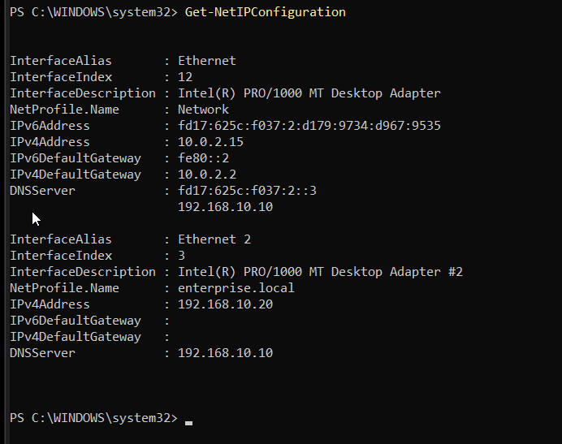

#### DNS Configuration

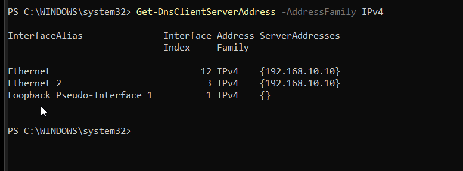

#### Ping DC01

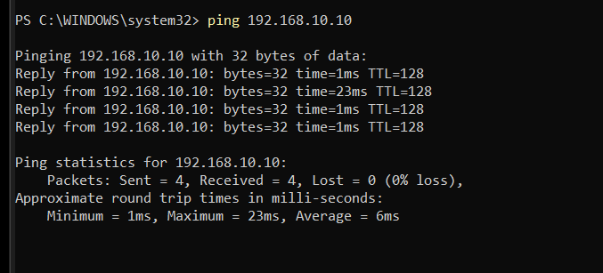

#### LDAP Port 389 Connectivity

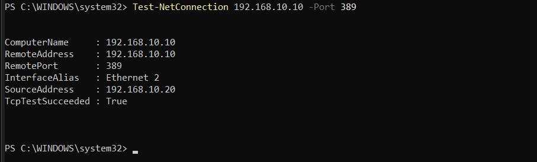

#### Enterprise Domain DNS Resolution

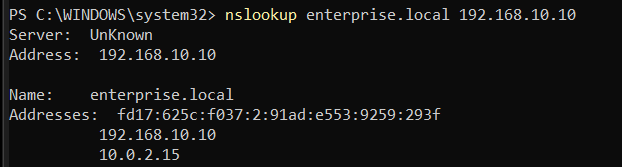

#### DC01 DNS Resolution

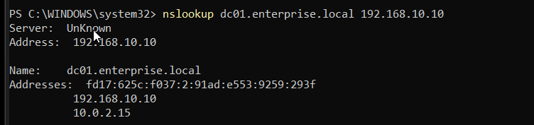

#### LDAP SRV Record

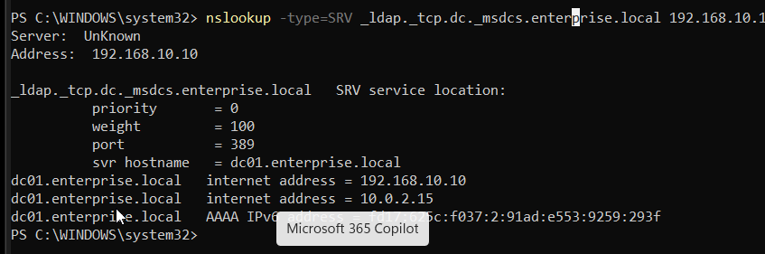

#### Pre-Join Domain Controller Discovery

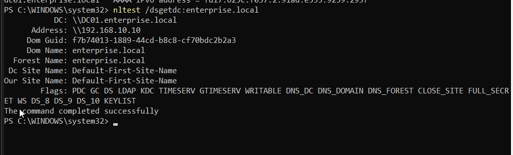

### Domain Join

#### Pre-Join System Properties

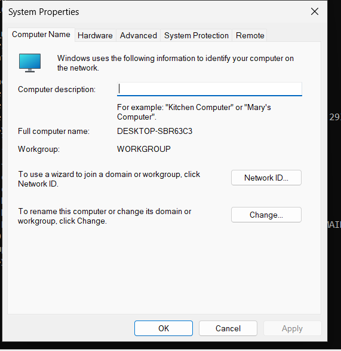

#### Domain Join Configuration

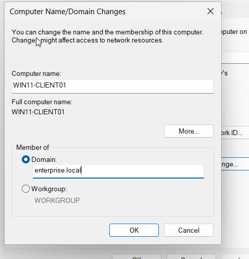

#### Domain Join Successful

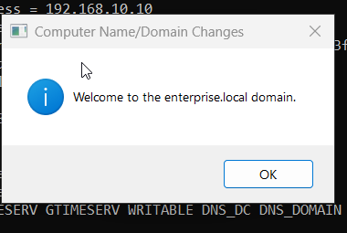

### Post-Join Validation

#### Domain User Authentication

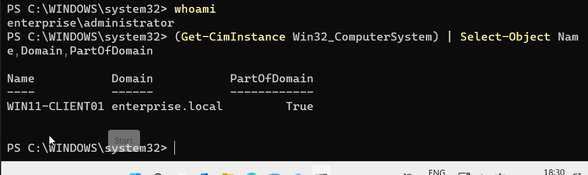

#### Post-Join Domain Controller Discovery

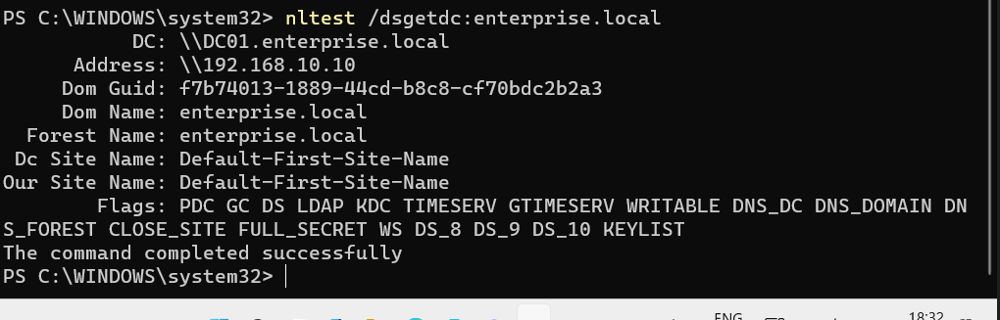

#### DC01 Computer Account

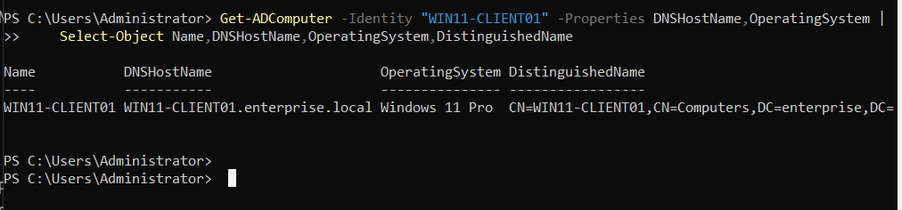

#### Active Directory Users and Computers

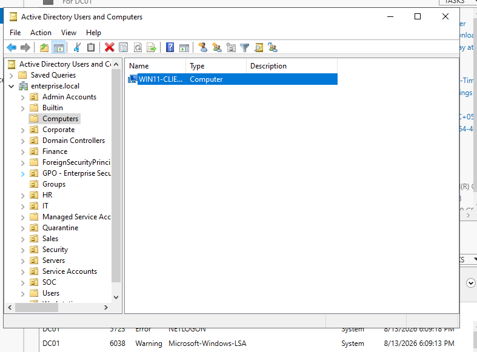

#### Secure Channel Verification

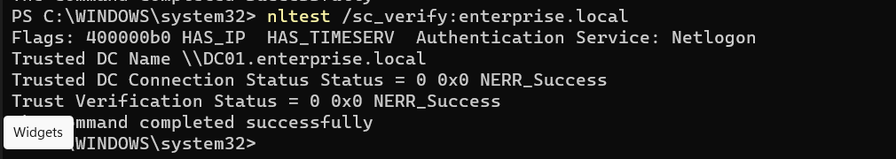

---

## Phase 16 Conclusion

The evidence confirms that `WIN11-CLIENT01` was successfully integrated into the `enterprise.local` Active Directory environment.

Network connectivity, DNS resolution, LDAP communication, Domain Controller discovery, domain membership, domain authentication, Active Directory computer-account registration, and secure-channel communication were validated successfully.

The Windows 11 endpoint is therefore ready to participate in centralized enterprise security monitoring and future SOC detection and incident-response activities.
