# Phase 17 – Kali Linux Attacker Setup

## Overview

Phase 17 introduced Kali Linux as the dedicated attacker and security testing workstation for the Enterprise SOC Lab.

The objective was to establish a controlled attack workstation on the isolated enterprise network and verify that it could communicate with the existing Active Directory domain controller and Windows 11 workstation.

The Kali system was configured with two network interfaces:

* NAT interface for Internet connectivity and security tool updates.
* Enterprise-Lab interface for communication with the isolated enterprise network.

No routing or gateway was configured on the Enterprise-Lab interface.

---

## Lab Environment

| Component                 | Configuration     |
| ------------------------- | ----------------- |
| Domain Controller         | DC01              |
| Domain                    | enterprise.local  |
| DC01 Enterprise IP        | 192.168.10.10     |
| Windows Client            | WIN11-CLIENT01    |
| Windows Client IP         | 192.168.10.20     |
| Attacker VM               | Kali Linux        |
| Kali Enterprise IP        | 192.168.10.30     |
| Enterprise Network        | 192.168.10.0/24   |
| Kali Enterprise Interface | eth1              |
| Virtualization Platform   | Oracle VirtualBox |

---

## Network Architecture

```text
                    Enterprise-Lab Network
                       192.168.10.0/24
                              |
          +-------------------+-------------------+
          |                   |                   |
          |                   |                   |
       DC01             WIN11-CLIENT01          Kali
   192.168.10.10          192.168.10.20      192.168.10.30
          |                   |                   |
          |                   |                   |
   Active Directory       Windows 11        Attacker /
       + DNS                                  Security
                                               Testing
```

Kali also maintains a separate NAT interface for Internet connectivity.

```text
Kali eth0
10.0.2.15
    |
 VirtualBox NAT
    |
 Internet

Kali eth1
192.168.10.30
    |
 Enterprise-Lab Internal Network
    |
 +-----------------------+
 |                       |
DC01                 WIN11-CLIENT01
192.168.10.10        192.168.10.20
```

---

## 1. Kali Network Configuration

The Kali Enterprise-Lab interface was configured with the static address:

```text
192.168.10.30/24
```

The interface did not receive a default gateway because the Enterprise-Lab network is intended to remain isolated.

The NAT interface remained responsible for Internet access.

### Verification

```bash
ip addr
```

The Enterprise-Lab interface was verified as:

```text
eth1
192.168.10.30/24
```

### Evidence

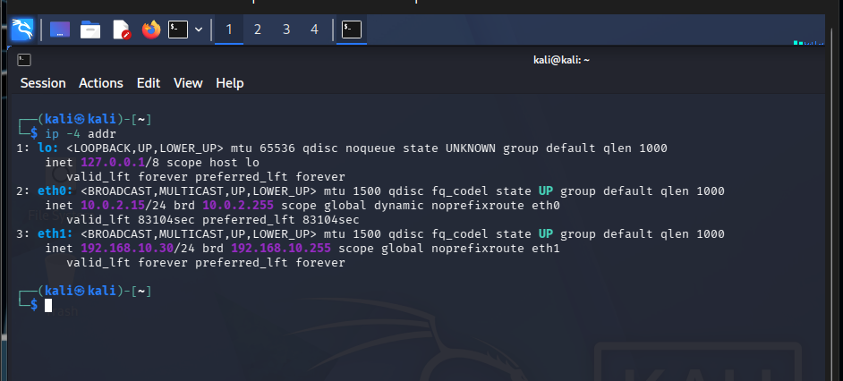

---

## 2. Enterprise Network Connectivity

Connectivity from Kali to the two Windows systems was verified.

### Domain Controller

```bash
ping -c 4 192.168.10.10
```

The test returned successful replies with 0% packet loss.

### Windows 11 Client

```bash
ping -c 4 192.168.10.20
```

The test returned successful replies with 0% packet loss.

This confirmed that Kali could communicate with the systems connected to the isolated Enterprise-Lab network.

### Evidence

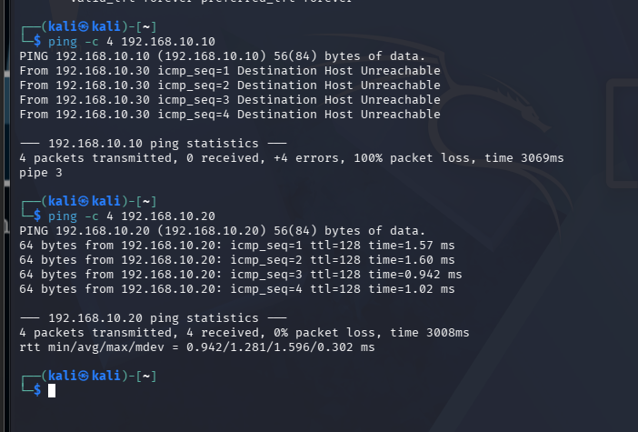

---

## 3. Windows 11 Service Discovery

Nmap was used from Kali to identify exposed TCP services on WIN11-CLIENT01.

```bash
nmap -Pn -sV -p 135,139,445 192.168.10.20
```

The following services were identified:

| Port    | State | Service                 |
| ------- | ----- | ----------------------- |
| 135/tcp | Open  | Microsoft Windows RPC   |
| 139/tcp | Open  | NetBIOS Session Service |
| 445/tcp | Open  | Microsoft-DS / SMB      |

Nmap identified the target as a Microsoft Windows system.

### Evidence

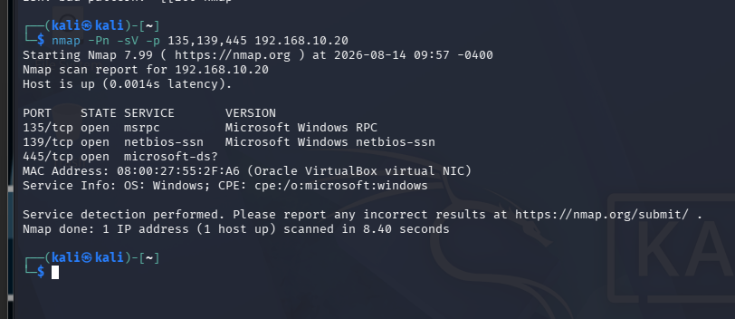

---

## 4. SMB Protocol Enumeration

The SMB protocol versions exposed by WIN11-CLIENT01 were enumerated using:

```bash
nmap -Pn -p 445 --script smb-protocols 192.168.10.20
```

The following SMB dialects were detected:

```text
2.0.2
2.1
3.0
3.0.2
3.1.1
```

SMB1 was not listed in the supported dialects.

This was consistent with the Windows SMB server configuration, which confirmed that SMB1 was disabled and SMB2/SMB3 was enabled.

### Evidence

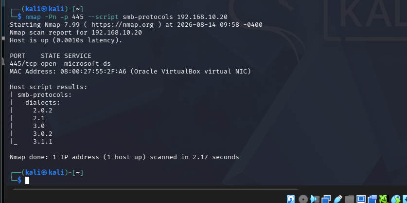

---

## 5. Anonymous SMB Access Test

An unauthenticated SMB share enumeration attempt was performed from Kali:

```bash
smbclient -L //192.168.10.20 -N -m SMB3
```

The Windows client returned:

```text
session setup failed: NT_STATUS_ACCESS_DENIED
```

This demonstrated that anonymous SMB session establishment was rejected.

The result was treated as a positive security-control observation rather than a failure.

### Security Observation

WIN11-CLIENT01 exposes SMB services on TCP/445 but does not permit the tested anonymous SMB session.

### Evidence


---

## 6. Windows SMB Security Configuration

The SMB server configuration on WIN11-CLIENT01 was verified using PowerShell:

```powershell
Get-SmbServerConfiguration |
Select-Object EnableSMB1Protocol,EnableSMB2Protocol,RejectUnencryptedAccess
```

The configuration returned:

```text
EnableSMB1Protocol       False
EnableSMB2Protocol       True
RejectUnencryptedAccess  True
```

### Security Assessment

| Configuration          | Result   | Assessment           |
| ---------------------- | -------- | -------------------- |
| SMB1                   | Disabled | Secure baseline      |
| SMB2/SMB3              | Enabled  | Modern SMB supported |
| Unencrypted SMB access | Rejected | Secure baseline      |

SMB1 was not enabled during this phase.

### Evidence

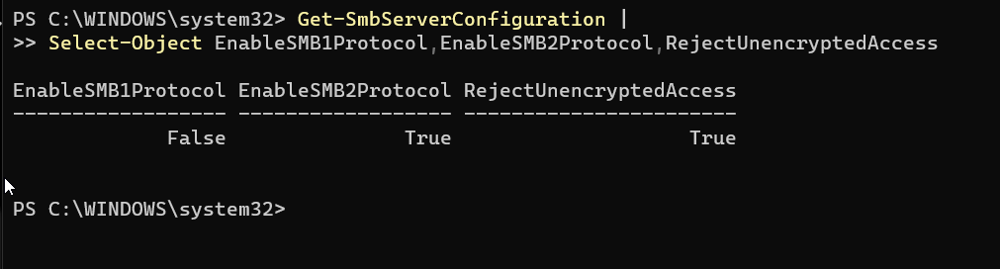

---

## 7. Windows SMB Shares

The available SMB shares on WIN11-CLIENT01 were inspected with:

```powershell
Get-SmbShare
```

The following default shares were present:

```text
ADMIN$
C$
IPC$
```

These are standard Windows administrative/system shares.

No additional test shares were created during Phase 17.

### Evidence

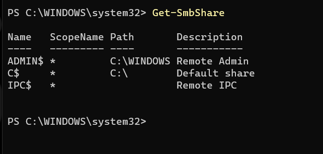

---

## 8. Phase 17 Security Findings

The Phase 17 reconnaissance established the following baseline:

1. Kali Linux successfully communicates with the isolated enterprise network.
2. WIN11-CLIENT01 exposes RPC, NetBIOS, and SMB-related services.
3. TCP/445 is reachable from the Kali attacker workstation.
4. SMB2 and SMB3 dialects are supported.
5. SMB1 is disabled.
6. Anonymous SMB session establishment was rejected.
7. Windows exposes the default administrative shares `ADMIN$`, `C$`, and `IPC$`.
8. Kali has a dedicated enterprise-network address of `192.168.10.30`.

These observations establish the baseline that will be used during later attack simulations and detection engineering activities.

---

## 9. Phase 17 Security Baseline

```text
Kali
192.168.10.30
     |
     | Enterprise-Lab
     |
     +-------------------+
     |                   |
     v                   v
DC01                 WIN11-CLIENT01
192.168.10.10        192.168.10.20
     |                   |
     |                   |
     +-------- AD -------+
```

The attacker workstation is now ready to perform controlled security testing against the enterprise environment.

---

## Phase Status

**Phase 17 – Kali Linux Attacker Setup: COMPLETED**

### Completed Activities

* [x] Kali Linux VM deployed
* [x] Kali login verified
* [x] NAT connectivity verified
* [x] Enterprise-Lab interface configured
* [x] Static IP `192.168.10.30` configured
* [x] DC01 connectivity verified
* [x] WIN11-CLIENT01 connectivity verified
* [x] Nmap service discovery completed
* [x] SMB protocol enumeration completed
* [x] Anonymous SMB access tested
* [x] Windows SMB configuration verified
* [x] Windows SMB shares verified
* [x] Security baseline established

---

## 10. Endpoint Security Telemetry Evidence

Phase 17 also established the endpoint telemetry baseline required for subsequent SOC monitoring and SIEM integration.

### Sysmon Configuration

The Windows endpoint Sysmon configuration was backed up, applied, and verified.

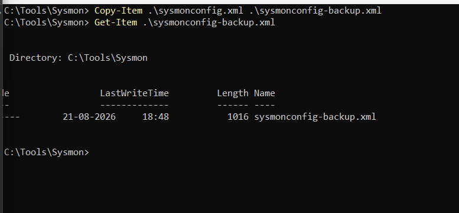

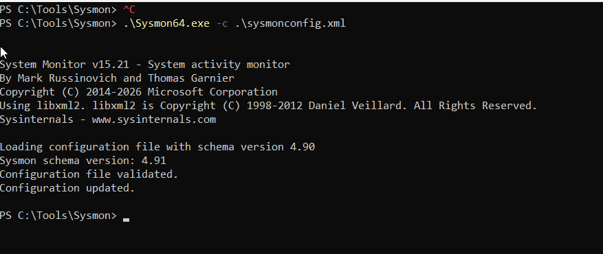

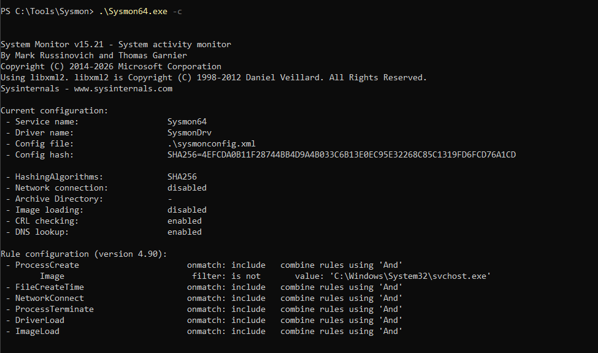

### Sysmon Network and File Telemetry

Sysmon network connection and file creation telemetry were validated on WIN11-CLIENT01.

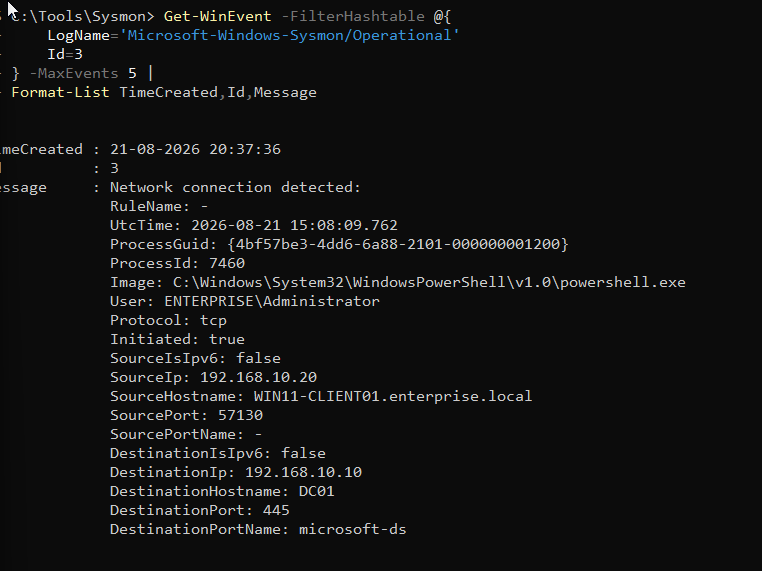

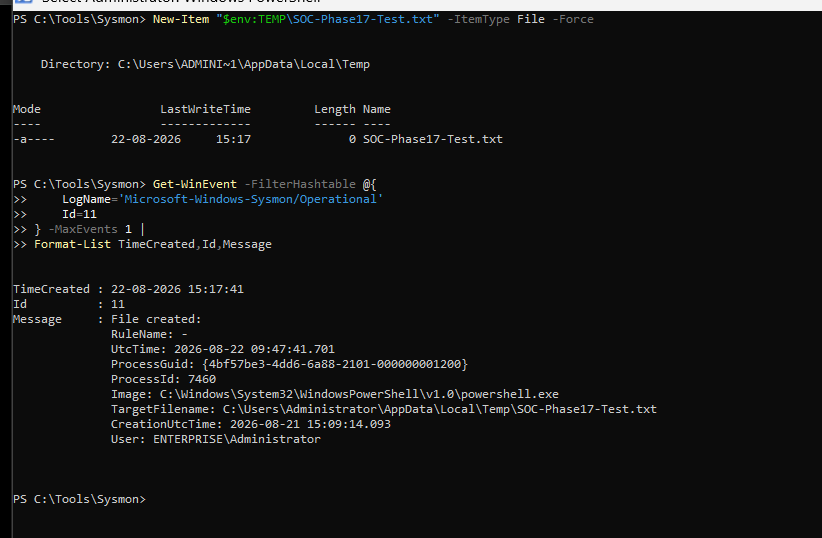

### Sysmon DNS Telemetry

DNS query telemetry was validated through Sysmon.

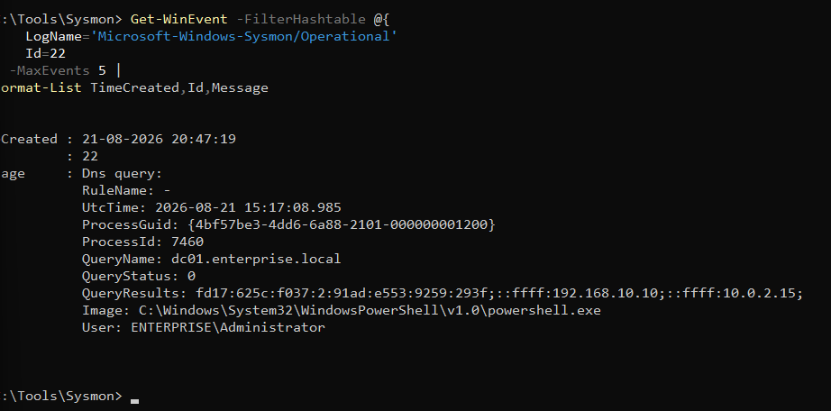

### Windows Security Telemetry

Windows Security event telemetry was validated for successful authentication, failed authentication, and process creation.

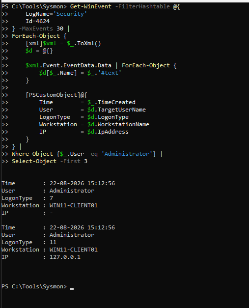

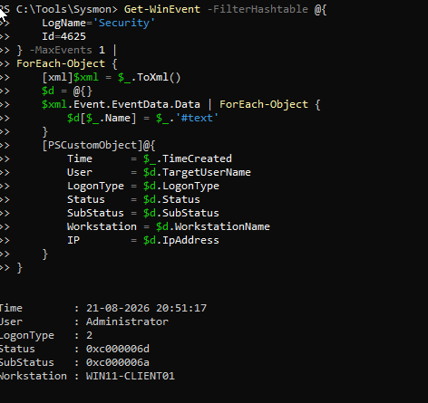

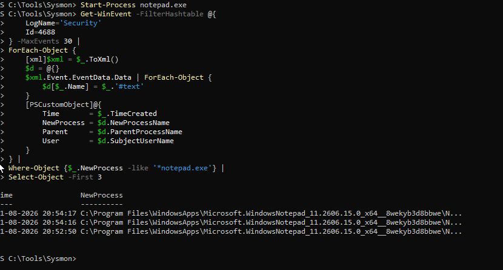

### PowerShell Telemetry

PowerShell Script Block Logging telemetry was validated through Event ID 4104.

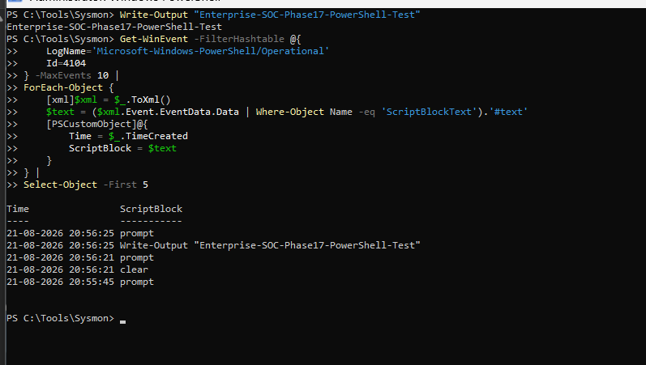

### Telemetry Readiness

The endpoint now provides the local security telemetry required for centralized SOC monitoring.

The validated telemetry sources include:

- Sysmon process creation
- Sysmon network connections
- Sysmon file creation
- Sysmon DNS queries
- Windows Security authentication events
- Windows Security process creation events
- PowerShell Script Block Logging

These local telemetry sources establish the endpoint-side foundation for the centralized SIEM deployment planned for Phase 18.---

## 10. Endpoint Security Telemetry Evidence

Phase 17 also established the endpoint telemetry baseline required for subsequent SOC monitoring and SIEM integration.

### Sysmon Configuration

The Windows endpoint Sysmon configuration was backed up, applied, and verified.


### Sysmon Network and File Telemetry

Sysmon network connection and file creation telemetry were validated on WIN11-CLIENT01.


### Sysmon DNS Telemetry

DNS query telemetry was validated through Sysmon.


### Windows Security Telemetry

Windows Security event telemetry was validated for successful authentication, failed authentication, and process creation.


### PowerShell Telemetry

PowerShell Script Block Logging telemetry was validated through Event ID 4104.


### Telemetry Readiness

The endpoint now provides the local security telemetry required for centralized SOC monitoring.

The validated telemetry sources include:

- Sysmon process creation
- Sysmon network connections
- Sysmon file creation
- Sysmon DNS queries
- Windows Security authentication events
- Windows Security process creation events
- PowerShell Script Block Logging

These local telemetry sources establish the endpoint-side foundation for the centralized SIEM deployment planned for Phase 18.---

## 10. Endpoint Security Telemetry Evidence

Phase 17 also established the endpoint telemetry baseline required for subsequent SOC monitoring and SIEM integration.

### Sysmon Configuration

The Windows endpoint Sysmon configuration was backed up, applied, and verified.


### Sysmon Network and File Telemetry

Sysmon network connection and file creation telemetry were validated on WIN11-CLIENT01.


### Sysmon DNS Telemetry

DNS query telemetry was validated through Sysmon.


### Windows Security Telemetry

Windows Security event telemetry was validated for successful authentication, failed authentication, and process creation.


### PowerShell Telemetry

PowerShell Script Block Logging telemetry was validated through Event ID 4104.


### Telemetry Readiness

The endpoint now provides the local security telemetry required for centralized SOC monitoring.

The validated telemetry sources include:

- Sysmon process creation
- Sysmon network connections
- Sysmon file creation
- Sysmon DNS queries
- Windows Security authentication events
- Windows Security process creation events
- PowerShell Script Block Logging

These local telemetry sources establish the endpoint-side foundation for the centralized SIEM deployment planned for Phase 18.---

## 10. Endpoint Security Telemetry Evidence

Phase 17 also established the endpoint telemetry baseline required for subsequent SOC monitoring and SIEM integration.

### Sysmon Configuration

The Windows endpoint Sysmon configuration was backed up, applied, and verified.


### Sysmon Network and File Telemetry

Sysmon network connection and file creation telemetry were validated on WIN11-CLIENT01.


### Sysmon DNS Telemetry

DNS query telemetry was validated through Sysmon.


### Windows Security Telemetry

Windows Security event telemetry was validated for successful authentication, failed authentication, and process creation.


### PowerShell Telemetry

PowerShell Script Block Logging telemetry was validated through Event ID 4104.


### Telemetry Readiness

The endpoint now provides the local security telemetry required for centralized SOC monitoring.

The validated telemetry sources include:

- Sysmon process creation
- Sysmon network connections
- Sysmon file creation
- Sysmon DNS queries
- Windows Security authentication events
- Windows Security process creation events
- PowerShell Script Block Logging

These local telemetry sources establish the endpoint-side foundation for the centralized SIEM deployment planned for Phase 18.---

## 10. Endpoint Security Telemetry Evidence

Phase 17 also established the endpoint telemetry baseline required for subsequent SOC monitoring and SIEM integration.

### Sysmon Configuration

The Windows endpoint Sysmon configuration was backed up, applied, and verified.


### Sysmon Network and File Telemetry

Sysmon network connection and file creation telemetry were validated on WIN11-CLIENT01.


### Sysmon DNS Telemetry

DNS query telemetry was validated through Sysmon.


### Windows Security Telemetry

Windows Security event telemetry was validated for successful authentication, failed authentication, and process creation.


### PowerShell Telemetry

PowerShell Script Block Logging telemetry was validated through Event ID 4104.


### Telemetry Readiness

The endpoint now provides the local security telemetry required for centralized SOC monitoring.

The validated telemetry sources include:

- Sysmon process creation
- Sysmon network connections
- Sysmon file creation
- Sysmon DNS queries
- Windows Security authentication events
- Windows Security process creation events
- PowerShell Script Block Logging

These local telemetry sources establish the endpoint-side foundation for the centralized SIEM deployment planned for Phase 18.
**Next Phase:** Phase 18 – Security Telemetry / Windows Logging
